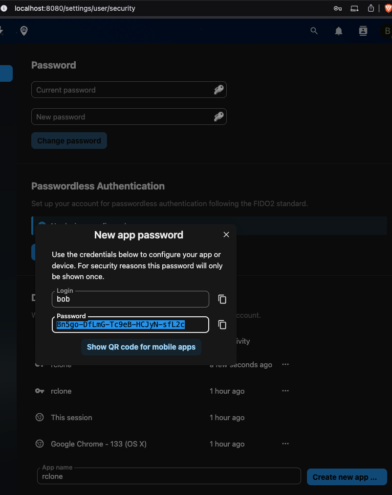

import Tabs from '@theme/Tabs'
import TabItem from '@theme/TabItem'

# Migrate

Migrate Personal Space Data to OpenCloud Using rclone

This guide will help you migrate personal space data from `NextCloud` and `oCIS` to `OpenCloud` using `rclone`. Follow these steps carefully to ensure a smooth migration!

## Generate users token using CLI or API

<Tabs>
<TabItem value="opencloud" label="OpenCloud">

## Run OpenCloud with the following configuration

Modify `.env` file:

```bash
START_ADDITIONAL_SERVICES="auth-app"
```

Enable `auth-app` service:

```bash
PROXY_ENABLE_APP_AUTH="true"
```

### Generate user token using CLI

Access the OpenCloud container:

```bash
docker exec -it opencloud-compose-opencloud-1 sh
```

Generate an authentication token for a user (e.g., `alan`) with expiration (`h`, `m`, `s`):

```bash
opencloud auth-app create --user-name=alan --expiration=72h
```

## Generate user token using API

Requires additional configuration! Start the server with:

```bash
AUTH_APP_ENABLE_IMPERSONATION=true
```

Then generate a token via API:

```bash
curl -vk -XPOST 'https://opencloud_url/auth-app/tokens?expiry=72h&userName=alan' -uadmin:admin
```

</TabItem>

<TabItem value="ocis" label="oCIS">

### Run oCIS with the following configuration

Modify `.env` file:

```bash
START_ADDITIONAL_SERVICES="auth-app"
```

Enable `auth-app` service:

```bash
PROXY_ENABLE_APP_AUTH="true"
```

## Generate user token using CLI

Access the oCIS container:

```bash
docker exec -it ocis_full-ocis-1 sh
```

Generate an authentication token for a user (e.g., `einstein`) with expiration (`h`, `m`, `s`):

```bash
ocis auth-app create --user-name=einstein --expiration=72h
```

## Generate user token using API

Requires additional configuration! Start the server with:

```bash
AUTH_APP_ENABLE_IMPERSONATION=true
```

Then generate a token via API:

```bash
curl -vk -XPOST 'https://ocis_url/auth-app/tokens?expiry=72h&userName=einstein' -uadmin:admin
```

</TabItem>

<TabItem value="nc" label="Nextcloud">

### Go to `Settings` → `Security`

Create a new App Password



</TabItem>
</Tabs>

## Install rclone

Download and install rclone by following the official guide: [rclone.org/install](https://rclone.org/install/)

## Encrypt Authentication Tokens

```bash
rclone obscure <token>
```

## Create the rclone Configuration

Edit the rclone configuration file and insert your token into the `pass` field:

```bash
nano ~/.config/rclone/rclone.conf
```

- Example Configuration

```bash
[opencloud-admin]
type = webdav
url = https://opencloud_url/remote.php/webdav
vendor = opencloud
owncloud_exclude_shares = true
user = admin
pass = sQOM4mn2DdR9ihRGkyAMcd50W6mniaSqSfx2qVOdBJs
description = opencloud-admin

[opencloud-alan]
type = webdav
url = https://opencloud_url/remote.php/webdav
vendor = opencloud
owncloud_exclude_shares = true
user = alan
pass = sQOM4mn2DdR9ihRGkyAMcd50W6mniaSqSfx2qVOdBJs
description = opencloud-alan

[ocis-admin]
type = webdav
url = https://ocis_url/remote.php/webdav
vendor = ocis
owncloud_exclude_shares = true
user = admin
pass = Sav5354nRTgBHyItQeCZp9tCBidX2BxbuMx_dDLwxqs
description = ocis-admin

[ocis-einstein]
type = webdav
url = https://ocis_url/remote.php/webdav
vendor = ocis-einstein
owncloud_exclude_shares = true
user = einstein
pass = dcYsf3PNvBxaIi7MMq-bqg74KMWWWS8p3uFT-WD17SA
description = ocis-einstein

[nc-admin]
type = webdav
url = http://nc_url/remote.php/webdav
vendor = nc
owncloud_exclude_shares = true
user = admin
pass = IBSkhC1wCDdS2Gt9iBV-C9IqlGek
description = nc-admin

[nc-bob]
type = webdav
url = http://localhost:8080/remote.php/webdav
vendor = nc-bob
owncloud_exclude_shares = true
user = bob
pass = ufOK3zPDjR4meEwwy3cWUVA18Lf8TpubBRyPL5m9KC508PkMiEVAXTxg6olu
description = nc-bob

```

## Prepare OpenCloud for a Large Migration

:::note Optional optimization
The steps in this section are intended for a large initial bulk import. Skip them for small
migrations where the additional system load is not a concern.
:::

A bulk import generates substantially more file events than normal operation. Temporarily exclude
the `activitylog` and `search` services to prevent activity processing and search indexing from
competing with the migration for system resources.

Add both services to `OC_EXCLUDE_RUN_SERVICES` in the OpenCloud `.env` file:

```dotenv
OC_EXCLUDE_RUN_SERVICES=activitylog,search
```

If the variable already contains other services, preserve them and append `activitylog` and `search`
to the comma-separated list. Restart the OpenCloud container after changing the configuration.

While the services are excluded:

- OpenCloud does not record activity history for files created or updated by the migration. This can
  prevent duplicate or misleading entries when data is migrated in multiple passes.
- Search results for migrated data remain incomplete until the search service is re-enabled and the
  index is rebuilt.

## Copy Data to OpenCloud

Use `rclone copy` to transfer data from `oCIS` and `Nextcloud` to `OpenCloud`:

```bash
rclone copy ocis-admin:/ opencloud-admin:/ --no-check-certificate -P  # Copy oCIS admin personal space to OpenCloud admin space
rclone copy ocis-einstein:/ opencloud-alan:/ --no-check-certificate -P  # Copy oCIS bob's personal space to OpenCloud admin space
rclone copy nc-bob:/ opencloud-alan:/ --no-check-certificate -P  # Copy Nextcloud admin personal space to OpenCloud admin space

```

## Restore Normal Operation After a Large Migration

If you applied the optimizations for a large migration:

1. Remove `activitylog` and `search` from `OC_EXCLUDE_RUN_SERVICES`, preserving any services that
   were excluded before the migration.
2. Restart OpenCloud and wait until the search service is ready.
3. Build the search index for all Spaces:

   ```shell
   docker compose exec opencloud opencloud search index --all-spaces
   ```

   Indexing can take a long time on large installations. Search results remain incomplete until it
   has finished.

## Migration Results and Limitations

Congratulations! You have successfully migrated personal space data to OpenCloud!

- Successfully Migrated
  - Personal space files

- Not Migrated
  - Shared files
  - Public links
  - Project spaces
  - Trash-bin contents
  - File versions
  - Metadata

## Security Step: Delete Tokens

Once the migration is complete, please delete tokens to prevent unauthorized access!
