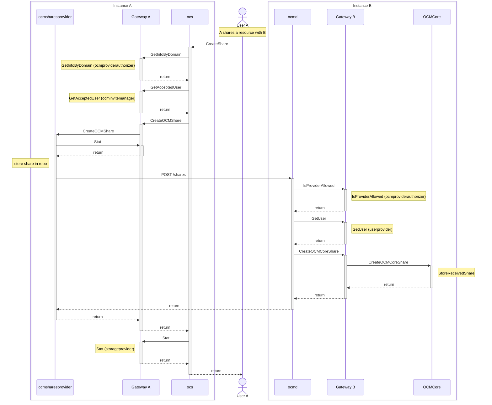

Ths diagram illustrates the flow of creating a share from Instance A to Instance B using the OCM (Open Cloud Mesh) protocol.

```mermaid
sequenceDiagram
box Instance A
participant osp as ocmsharesprovider
participant gwa as Gateway A
participant httpa as ocs
end
actor usera as User A
box Instance B
participant httpb as ocmd
participant gwb as Gateway B
participant ocmc as OCMCore
end

    Note over usera: A shares a resource with B
    usera->>+httpa: CreateShare
        httpa->>+gwa: GetInfoByDomain
        Note left of gwa: GetInfoByDomain (ocmproviderauthorizer)
        gwa-->>-httpa: return

        httpa->>+gwa: GetAcceptedUser
        Note left of gwa: GetAcceptedUser (ocminvitemanager)
        gwa-->>-httpa: return

        httpa->>+gwa: CreateOCMShare
            gwa->>+osp: CreateOCMShare
                osp->>+gwa: Stat
                gwa-->>-osp: return

                Note left of osp: store share in repo

                osp->>+httpb: POST /shares
                    httpb->>+gwb: IsProviderAllowed
                    Note right of gwb: IsProviderAllowed (ocmproviderauthorizer)
                    gwb-->>-httpb: return

                    httpb->>+gwb: GetUser
                    Note right of gwb: GetUser (userprovider)
                    gwb-->>-httpb: return

                    httpb->>+gwb: CreateOCMCoreShare
                        gwb->>+ocmc: CreateOCMCoreShare
                        Note right of ocmc: StoreReceivedShare
                        ocmc-->>-gwb: return
                    gwb-->>-httpb: return
                httpb-->>-osp: return
            osp-->>-gwa: return
        gwa-->>-httpa: return
        httpa->>+gwa: Stat
            Note left of gwa: Stat (storageprovider)
        gwa-->>-httpa: return
    httpa-->>-usera: return
```
