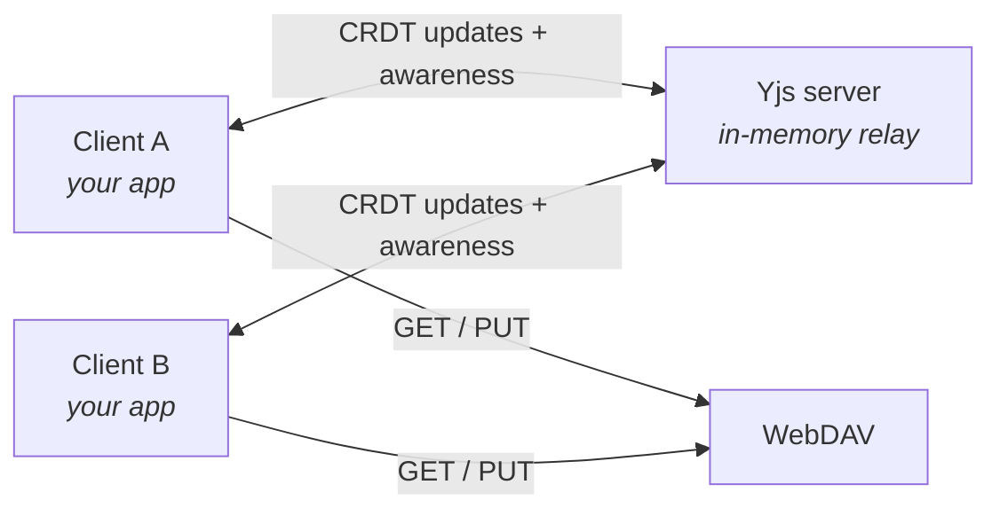

OpenCloud Web uses [Yjs](https://yjs.dev/) for real-time collaborative editing, which allows multiple users to edit the
same document simultaneously while ensuring that all changes are consistently merged. Yjs is a CRDT framework. Every
client holds its own replica of the document, and all replicas converge to the same state.

An editor app opts into collaboration with one route option and one adapter. Everything else - loading, saving, etag
handling and conflict resolution - stays abstract in the `AppWrapper`.

## How it fits together



The Yjs server only relays updates between clients in the same room. It never reads or writes the file, and it keeps no
state after the last client leaves. The file is always loaded and saved by the browser over WebDAV.

One room is one opened file. The room name contains the file id, an app prefix and the Web version. Apps with different
Y.Doc layouts therefore never share a room.

## Requirements

Collaborative editing is only active if the deployment sets `WEB_OPTION_YJS_SERVER_URL`. See the
[admin documentation](../../../../admin/configuration/collaborative-editing) for the server setup.

The Yjs server authenticates the user with a bearer token against the LibreGraph API, and it checks the permissions of
the file. Contexts without a user token, for example public links or OCM, always fall back to local mode.

## Turning it on in your app

Collaboration is a `yjs` option on `AppWrapperRoute`. The rest of the app setup is the same as for any other editor
app:

```typescript title="src/index.ts"
import { AppWrapperRoute, defineWebApplication } from '@opencloud-eu/web-pkg';
import { useGettext } from 'vue3-gettext';
import App from './App.vue';
import { makeMyAdapter } from './yjs';

export default defineWebApplication({
  setup() {
    const { $gettext } = useGettext();
    const appId = 'my-editor';

    const routes = [
      {
        name: appId,
        path: '/:driveAliasAndItem(.*)?',
        component: AppWrapperRoute(App, {
          applicationId: appId,
          yjs: {
            // Builds the bridge between the file format and the shared Y.Doc.
            makeAdapter: makeMyAdapter,

            // Optional. Room namespace, defaults to the applicationId.
            documentPrefix: appId
          }
        }),
        meta: {
          authContext: 'hybrid',
          title: $gettext('My Editor'),
          patchCleanPath: true
        }
      }
    ];

    return {
      appInfo: {
        name: 'My Editor',
        id: appId,
        defaultExtension: 'md',
        extensions: [{ extension: 'md', routeName: appId }]
      },
      routes
    };
  }
});
```

## The adapter

The Yjs session is generic. It handles the connection, the hydration and the etag loop. The adapter tells it how to move
content between the native file format and the Y.Doc.

```typescript
interface YjsAdapter {
  /** Seed an empty Y.Doc from the file content. Must be a no-op if the doc already has content. */
  hydrate(ydoc: Y.Doc, content: string): void;

  /** Render the current Y.Doc state back to the native file format. */
  serialize(ydoc: Y.Doc): string | Promise<string>;

  /** True if the Y.Doc already holds app content. */
  hasContent(ydoc: Y.Doc): boolean;

  /** Optional. Wipe the shared content so `hasContent` returns false again. */
  reset?(ydoc: Y.Doc): void;
}
```

Rules to keep in mind:

- `hydrate` must be synchronous. Stale recovery wipes and re-seeds the document in one go.
- `serialize` runs on every peer after each pause in typing. Keep it cheap, and do not build an editor instance in it.
- `makeAdapter` runs during the setup of the `AppWrapper`, before the file is loaded. It gets a reactive context
  `{ resource: Ref<Resource> }` and must read it lazily. Because it runs in setup, it may use composables.

### Tiptap based apps

If your editor is built on Tiptap, use `makeTiptapYjsAdapter`. It takes a content strategy and returns a ready adapter:

```typescript title="src/yjs.ts"
import { ref } from 'vue';
import type { YjsAdapter, YjsAdapterContext } from '@opencloud-eu/web-pkg';
import { makeTiptapYjsAdapter, useContentStrategy } from '@opencloud-eu/web-pkg/editor';

export function makeMyAdapter({ resource }: YjsAdapterContext): YjsAdapter {
  const { resolveStrategy } = useContentStrategy();

  const strategy = resolveStrategy('markdown', {
    sourceMode: ref(false),
    linkPanel: ref(null),
    editorZoom: ref(100),
    currentResource: resource
  });

  return makeTiptapYjsAdapter(strategy);
}
```

The strategy must be resolved in setup, so resolve it here and not inside the adapter methods. To support several
content types, resolve one strategy per type and pass a getter that picks by `resource`.

The content lives in a `Y.XmlFragment` named `default`. `Collaboration` from Tiptap writes into it.

## The app component

The `AppWrapper` passes the session down as slot props. Declare the props you need. `YjsEditorSlotProps` is a preset for
collaborative editors:

```typescript
type YjsEditorSlotProps = {
  resource: Resource;
  space: SpaceResource;
  currentContent: string;
  isReadOnly: boolean;

  /** The shared document. */
  ydoc: Y.Doc | null;

  /** Peer presence: cursors, selections and user identity. */
  awareness: Awareness | null;

  /** 'connecting' | 'connected' | 'disconnected' | 'local' */
  yjsStatus: YjsStatus | null;
};
```

The `AppWrapper` keeps its loading screen up until the session is synced and hydrated. Your component therefore mounts
against a Y.Doc that is ready, and `ydoc` and `awareness` are never null inside it.

```html title="src/App.vue"
<script setup lang="ts">
  import { toRef } from 'vue';
  import { useTextEditor } from '@opencloud-eu/web-pkg/editor';
  import type { YjsEditorSlotProps } from '@opencloud-eu/web-pkg';

  const { ydoc, awareness, isReadOnly, resource, yjsStatus } = defineProps<YjsEditorSlotProps>();

  const textEditor = useTextEditor({
    contentType: 'markdown',
    currentResource: toRef(() => resource),
    readonly: () => isReadOnly,
    ydoc,
    awareness,
    yjsStatus: () => yjsStatus
  });
</script>
```

`useTextEditor` binds Tiptap to the Y.Doc and renders the remote cursors. If you build your own editor, bind it to
`ydoc` yourself, with the binding your editor library provides.

### Showing the collaborators

`useYjsCollaborators` turns the awareness states into a list of users. The own user comes first, peers follow sorted by
name. A user with several tabs open appears once.

```typescript
import { useYjsCollaborators } from '@opencloud-eu/web-pkg';

const collaborators = useYjsCollaborators(awareness);
// [{ id, name, color, isSelf }]
```

The identity and the color come from the Yjs server, not from the client. A client cannot present itself as someone
else.

## Saving

Saving does not change. The `AppWrapper` writes the file over WebDAV with `If-Match`, either on `Ctrl+S` or through the
autosave timer. Collaboration only changes where the content comes from:

1. A user types, the update reaches every peer.
2. 300 ms after typing stops, the session calls `adapter.serialize` and updates `currentContent`.
3. `isDirty` flips to true. No request is sent yet.
4. On save, the `AppWrapper` sends the `PUT` and shares the new etag with the room.
5. Peers whose edits are covered by that write become clean again.

If a save comes back with a conflict, the wrapper first checks whether the conflicting write came from the same room. If
it did, it retries. If an external client wrote the file, the user gets the conflict dialog.

## Local mode

If no Yjs server URL is configured, the session still creates a Y.Doc and an awareness object, but it skips the
connection and hydrates at once. The status is `local`.

The same happens if the server cannot be reached. After a timeout, the session gives up, hydrates locally and shows an
error saying that changes are not shared. The file stays editable and can be saved.

Your binding is the same in both modes, so you do not need a branch for it.

## Read-only users

A user without write permission connects in read-only mode. The Yjs server rejects all their updates. The
`AppWrapper` sets `isReadOnly`, and `isDirty` stays false for them.

## Limits

- Nothing is saved without an open browser. If all clients close between autosaves, the edits since the last save are
  lost.
- Every peer autosaves, so one document is saved once per open client per interval.
- Remote edits mark your app dirty, so the unsaved-changes guard can fire for edits you did not make.
- Different Web versions do not share a room. During a rolling upgrade, users end up in separate rooms.

For the full architecture, the hydration election and the stale recovery, see the
[Yjs developer doc](https://github.com/opencloud-eu/web/blob/main/dev/docs/yjs.md) in the web repository.

## Example

The [Excalidraw app](https://github.com/opencloud-eu/web-extensions/tree/main/packages/web-app-excalidraw) in the
`web-extensions` repository is a complete example. It uses its own adapter and its own Y.Doc layout, not Tiptap.
