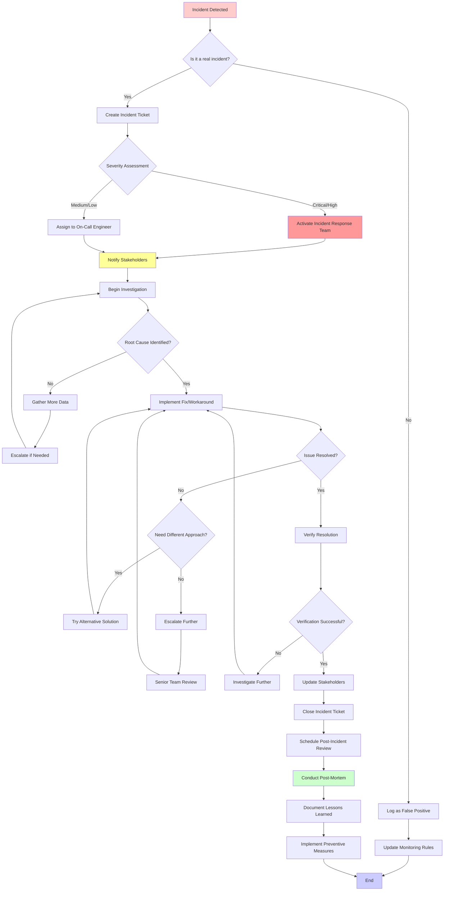

<!-- markdownlint-disable MD041 -->

import OcLogoPetrol from '/static/img/oc-logo-petrol.svg';
import OcLogoLilac from '/static/img/oc-logo-lilac.svg';

<!-- markdownlint-enable MD041 -->

# Training

## Welcome to the OpenCloud Trainings page

## Incident Management Workflow

