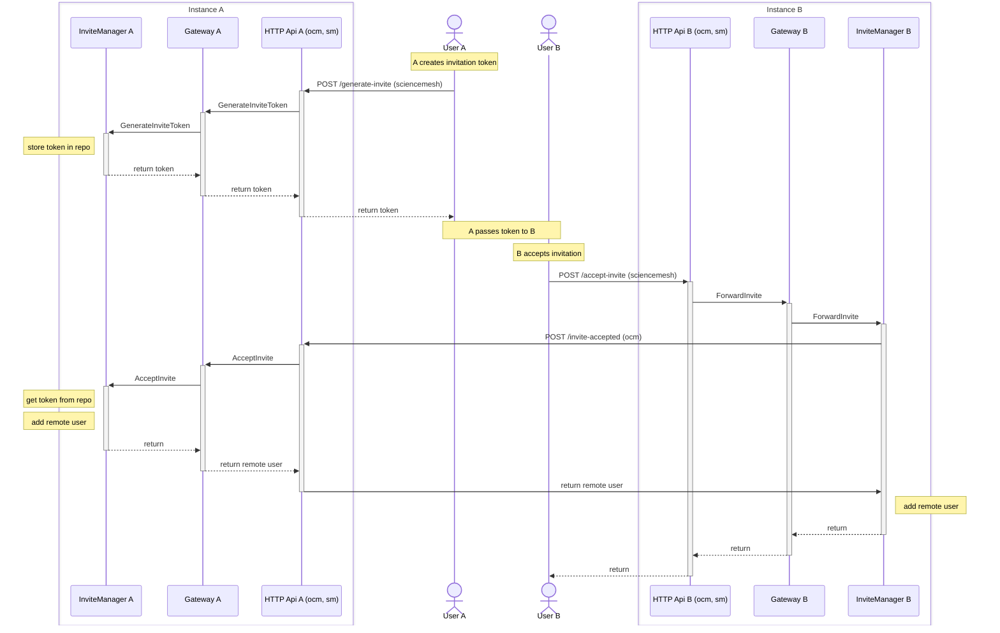

This diagram illustrates the flow of creating and accepting an invitation token between two instances (A and B) in a federated environment.

```mermaid
sequenceDiagram
box Instance A
participant ima as InviteManager A
participant gwa as Gateway A
participant httpa as HTTP Api A (ocm, sm)
end
actor usera as User A
actor userb as User B
box Instance B
participant httpb as HTTP Api B (ocm, sm)
participant gwb as Gateway B
participant imb as InviteManager B
end

    Note over usera: A creates invitation token
    usera->>+httpa: POST /generate-invite (sciencemesh)
        httpa->>+gwa: GenerateInviteToken
            gwa->>+ima: GenerateInviteToken
                Note left of ima: store token in repo
            ima-->>-gwa: return token
        gwa-->>-httpa: return token
    httpa-->>-usera: return token

    Note over usera,userb: A passes token to B

    Note over userb: B accepts invitation
    userb->>+httpb: POST /accept-invite (sciencemesh)
        httpb->>+gwb: ForwardInvite
            gwb->>+imb: ForwardInvite
                imb->>+httpa: POST /invite-accepted (ocm)
                    httpa->>+gwa: AcceptInvite
                        gwa->>+ima: AcceptInvite
                             Note left of ima: get token from repo
                             Note left of ima: add remote user
                        ima-->>-gwa: return
                    gwa-->>-httpa: return remote user
                httpa->>-imb: return remote user
                Note right of imb: add remote user
            imb-->>-gwb: return
        gwb-->>-httpb: return
    httpb-->>-userb: return
```
